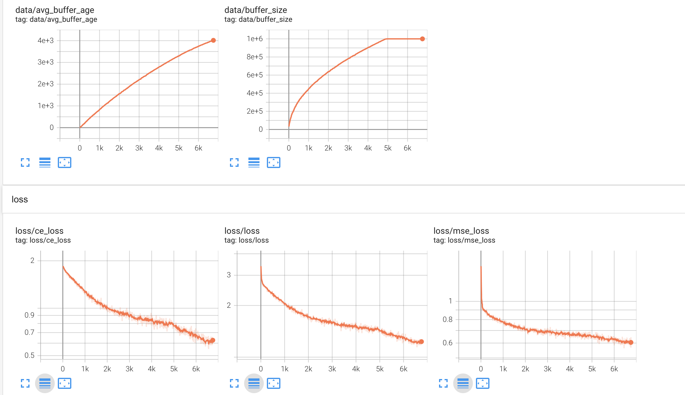
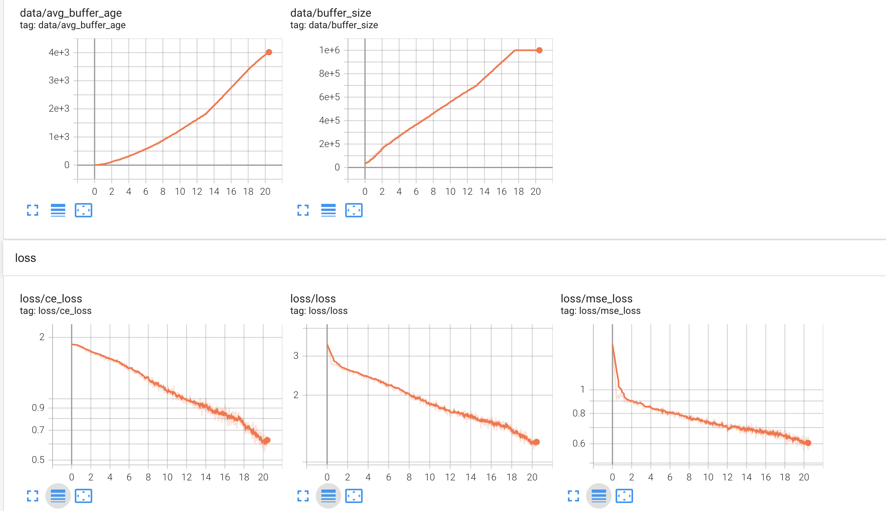

# Asynchronous AlphaZero in PyTorch
Complete implementation of DeepMind's [AlphaZero](https://arxiv.org/abs/1712.01815) paper.

## Features
1. Performant asynchronous training and self-play
2. Multi-machine support using a centralised data-broker
3. Agent evaluation in a league setting using `trueskill`
4. Shipped with two parametrizable games: 
    - *ConnectX* (e.g. the standard variant Connect4)
    - *CrossKalah* 
5. Robustness to losses of participants. 
   - Any participating processes may die at any point and after restart start participating again.
   - Resuming training from checkpoints even when all participants fail.
6. Play against any checkpoint with a single command.

## Usage
### 1. Training: 
#### 1.1. Starting the data-broker
```
python main.py --start_server 
```
An `ssh`-server is expected to be running on the data-broker's machine. 
The `ssh`-server is required to transport the network parameters between the participants via `scp`.

The data-broker listens for incoming connections from the trainer or the self-play workers.
It stores self-play data and a reference to the latest network-parameters and distributes these when requested for.

Network parameters are stored under `/tmp/`.

Per default the data-broker listens on the port `29500`. This may be changed using the `--port` argument.

#### 1.2. Starting the trainer.
```
python main.py --trainer --user <username> --ip <data-broker-ip>
```
This starts the trainer. The trainer will fetch self-play data from the data-broker and train on it.
The training speed may be throttled to avoid overfitting on the data in the buffer.
This is done in two ways: 
1. a minimum buffer size `min_buffer_size` before the training can start.
2. the amount of optimization steps the average sample is exposed to: `steps_per_observation`.

You will be prompted to enter the password to the data-brokers machine. 
This is required to push new network parameters to that machine via `scp`. 
If you don't trust me saying this, check `main.py`, search for `getpass` and see where this password is used.

If you want to continue training from an existing checkpoint, use the `--init_from_ckp`
argument and give the path to the checkpoint (not the folder!).

Lastly, you might want to limit training time to a certain amount of time.
The `--hours` argument will allow you to specify for how many hours the process will participate.

#### 1.3 Starting the self-play workers.
```
python main.py --user <username> --ip <data-broker-ip> --n_proc <number-of-self-play-processes>
```
This starts a self-play worker, that executes self-play games with the latest network-parameters with `n_proc` processes in parallel.
Completed self-play matches are gathered and send to the data-broker.

Similarly to the trainer, the password to access the data-broker's machine is required.

As a guideline for selecting the amount of processes, use the number of cores on the specific machines.
Repeat this on as many machines as you like. But be warned: the data-broker is probably going to be a bottleneck at some point.
This implementation has been tested with participating 4 machines, where it did work nicely.
The setup was the following:

**Machine**:
1. Data-broker + self-play worker `n_proc=12`
2. Trainer + self-play worker `n_proc=12`
3. Self-play worker `n_proc=16`
4. Self-play worker `n_proc=16`

Lastly, the maximum batch-size for position evaluation can be adjusted in the file `self_play/eval_process.py`.
If you use a reasonable network size, this won't become an issue.

#### 1.4 Start Evaluator
```
python eval.py --ckp_folder ./results --verbose
```
This starts the evaluator. The evaluator runs a set of matches `--num_matches`
for each new checkpoint against all other existing checkpoints. 
This is done intelligently by estimating the player's strength using `trueskill` to find the most even match.

Also note that during evaluation, the players still select moves for the first `ply_deterministic` moves proportional to their visit count.
This means that the play observed (when using `--verbose`) might not be the strongest, but it covers a wider range of play than
if they would select deterministically from start to finish.

Lastly it might make sense to adjust the amount of time spent per move with the `--thinking-time` argument.

#### 1.5 Start tensorboard
```
tensorboard --logdir ./results --port 6006
```
This should be run on the machine that runs the training. 
Observe the training progress!

Some more training metrics should be added. Right now only a minimal set of metrics is tracked.
For example, tracking the policy entropy might be a good idea.

### 2. Play against AlphaZero
```
python alphazero.py <path-to-checkpoint>
```
Have fun! :)

## Pre-trained weights

### Connect X
A checkpoint can be found in `resources/ckp_18.pth` (@18k steps).
It plays strong but not optimal.

## Requirements
```
numpy==1.21.2
pytorch==1.10.1
twisted==21.7.0
paramiko==2.8.1
scp==0.14.1
pyyaml==6.0
trueskill==0.4.5
tensorboard==2.8.0 
```

If you just want to play AlphaZero using the pre-trained weights, you just need:

```
numpy==1.21.2
pytorch==1.10.1
```

## Parameter overview
All training, game and search parameters are specified in a configuration file to keep the command-line arguments overseeable.
1. `game_name: ConnectX` The name of the game
2. `game_kwargs: {width: 7, height: 6, x: 4}` parameters of the game.
3. `net_kwargs: {num_layers: 9, num_filters: 256}` parametrizes the `ResNet`.
4. `mcts_kwargs: {num_simulations: 128, virtual_threads: 2, ply_deterministic: 4,
                       c_puct: 5, alpha: 0.5, eta: 0.25, n_vl: 3}` parametrizes the MCTS search.
    - `num_simulations`: the number of MCTS simlations
    - `virtual_threads`: Due to Python's GIL threading as done in the paper cannot be realized. 
    To establish some sort of equivalent, I introduced virtual threads. These are not running in parallel as in the paper, but in sequence. 
     Virtual loss ensures that the threads explore different positions. It speeds up the MCTS search, because of the reduced overhead of evaluating small batch-sizes. 
     But be careful setting this parameter too high (e.g. `64`), as this might impact performance otherwise.
    - `ply_deterministic`: At which depth the temperature parameter will be set to 0 and moves are chosen deterministically.
    - `c_puct`: "Exploration strength" parameter (`5`in the paper).
    - `alpha`: Dirichlet concentration parameter. The bigger the less likely it is that a single move will be foreced to be explored. Scaled inversely to the game's branching factor.
    - `eta`: Dirichlet noise strength in `[0, 1]`. `0.25` in the paper.
    - `n_vl`: Virtual loss parameter. `3` in the paper. 
5. ` train_kwargs : {batch_size: 1024, num_batches_per_step: 1,
                        buffer_size: 1_000_000, min_buffer_size: 50000,
                        num_iter_per_publish: 1, num_iter_per_ckp: 1000,
                        max_iter: 100000, lr: 0.2, steps_per_observation: 1, 
                        momentum: 0.9, weight_decay: 1e-4, lr_decay_step: [30000, 60000, 90000]}` Neural network training parameters.
    - `num_batches_per_step`: Many batches of gradients to accumulate before one optimization step.
    - `buffer_size`: how many positions will be stored to sample from during training.
    - `min_buffer_size`: the minimum buffer size required to start training.
    - `num_iter_per_publish`: after how many optimization steps should the current parameters be published?
    - `steps_per_observation`: how often should a position be sampled for training on average? Ideally, this is exactly `1` but
      depending on your available compute resources, you might want to increase to see progress in a reasonable amount of time.
    This throttling of the training speed is required if you do not generate self-play data at a fast enough pace.
      Otherwise, your net will overfit on the few positions it observed early in the training, which will affect the quality of all self-play data coming afterwards.
    - Other parameters are general DL parameters I will not explain here.
6.  - `MAX_GAME_LEN` in `self_play/self_play_process.py`: the maximum game length after which it will be declared a draw.
## Adding games
All you need to do to add and train AlphaZero on your own game is to implement the `games.interface.Game` interface and add an entry to the `make_game` function in `games.__init__.py`.

The game interface requires you to implement a set of functions. 
Most of these are self-explanatory. Those that require attention are listed below.

1. `valid_action_mask` should return a boolean mask that indicate which actions are valid in the current position from the set of all available actions.
   The `valid_actions` function is a derivative of `valid_action_mask`, yielding `np.arange(len(self.num_actions))[self.valid_action_mask()]` 
2. `get_state` and `set_state` must work in conjunction. 
   E.g. if you do `state = game.get_state()`, `game.step(0)` and then `game.set_state(state)` the game must be in the same state as it was before calling `step`. 
3. `get_obs` should return a representation of the current position from the **perspective of the current player!**.
4. `get_first_player_reward` should return the reward for the player that made the first move and should be in `{-1, 0, 1}`

## Further unorganized notes
You might wonder why I didn't use `torch.distributed`. Because it does not work.
Or at least I could not get it to work without an error 30 minutes into the training. 
Furthermore it does not allow participants to join and drop without affecting all other participants.

There is also low-cost potential for faster data generation on the self-play side.
1. Currently, no games are forfeit as done in the paper.
2. Also, simulating moves with only one action may be skipped. 
3. No transposition tables are used.

The self-play part of the algorithm is really costly and where most of the effort should go. 
You ideally need lots of data (say 500-1000 positions per second) to really train AlphaZero to it's full potential.
Just for reference, DeepMind has generated about 9 go matches per second for 40 days straight in the [Alpha Go Zero paper](https://www.nature.com/articles/nature24270.epdf?author_access_token=VJXbVjaSHxFoctQQ4p2k4tRgN0jAjWel9jnR3ZoTv0PVW4gB86EEpGqTRDtpIz-2rmo8-KG06gqVobU5NSCFeHILHcVFUeMsbvwS-lxjqQGg98faovwjxeTUgZAUMnRQ)!
With an average game length of 200-300 positions, that's about 1350 positions per second.
No optimization throttling needed there...

Another interesting observation for a run on `ConnectX(7, 6, 4)` was that
the training progress was hinged on the new data added to the buffer, not on the amount of steps done on the existing data.
This can be inferred from the plots below:
#### Training progress in "step-time"

#### Training progress in wall-time since start of the training in hours.

In "step-time", the training progress slowed down continually until step 5000 (when the buffer got full and old samples were discarded).
When contrasted to the wall-time, we see that the training did not slow down at all (as the data-generation was almost constant throughout), we just increased the rate at which we optimized. 
I.e. the most crucial part of AlphaZero is the rate at which self-play data can be generated.

There are three more interesting things happening here I want to touch on.
1. Notice the two small elbows in the wall-time buffer size plot? 
   This is where a self-play worker dropped out of the training. The second elbow was the addition of this worker.
2. When the buffer got full, old data was overwritten and the training progressed much faster than before.
    The earliest self-play data seems to have not been consistent with the more recent data, slowing progress.
3. Notice the throttling of optimization steps early on when the buffer still was relatively empty (see buffer size in step-time).
    When the buffer is partially full, the throttling also takes that into account.
   Earlier runs without throttling overfitted heavily on the earliest data received. 
   The data generated from this overfitted network consecutively generated low quality data, recommending only the positions it saw in the earliest iterations.
   
